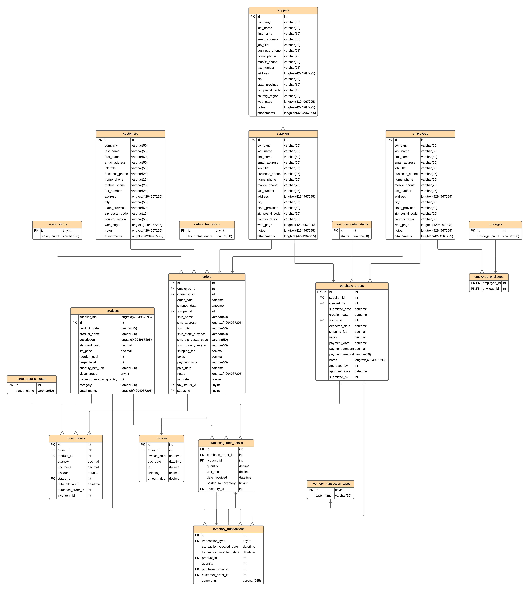

# DW_lab_6630200343
Lab 1 (10/07/69)
## Introducing OLAP for Northwind OLTP Database
**What's the current setup or architecture?**

- Northwind traders are companies that buy and sell special foods worldwide.
- This is a practice database made by Microsoft to showcase its product features and for learning purposes.
- The current setup combines on-site and older systems.
- They use MySQL for their main daily sales transactions.
- MySQL is also used for creating and running reports, but it's not efficient because analytical queries slow down the transaction system.

### Identifying Business Requirements
Throughout the interview process with the business and stakeholders, the following business processses were identified:
- **Sales Overview:**
Overall sales reports to understand better, what is being sold to our customers, what sells the most, where and what sells the least, the goal is to have a general overview of how the business is going.

This means the business is looking forward to getting insights on sales overview.

### Identifying required tables from ERD

From the above ERD diagram of the OLTP transactional system, we identify the following required tables that will enable us to meet the business requirements:

 
<li>Customers - Customers who buy items from Northwind</li>
<li>Employees - Those who work for Northwind</li>
<li>Orders - Sales Order transactions taking place between the customers & Northwind</li>
<li>Order Details - Order Details for the Orders placed by customer</li>
<li>Inventory Transaction - Transaction details of each inventory</li>
<li>Products - Current Northwind products that customers can purchase</li>
<li>Shippers - Shipped orders from Northwind to customers</li>
<li>Suppliers - Supplies Northwind with required items</li>
<li>Invoices - Invoice created for each order</li>

### **Staging Layer**
In the staging layer, we have the following tables:
- customers: load customers from datasets/customer.csv and insert ingestion timestamp.
- employees: load employees from datasets/employees.csv and insert ingestion timestamp.
- orders: load orders from datasets/orders.csv and insert ingestion timestamp.
- order_details: load order_details from datasets/order_details.csv and insert ingestion timestamp.
- inventory_transactions: load inventory_transactions from datasets/inventory_transactions.csv and insert ingestion timestamp.
- products: load products from datasets/products.csv and filter out rows where supplier_ids contains multiple semicolon-delimited values and insert ingestion timestamp.
- shippers: load shippers from datasets/shippers.csv and insert ingestion timestamp.
- suppliers: load suppliers from datasets/suppliers.csv and insert ingestion timestamp.
- invoices: load invoices from datasets/invoices.csv and insert ingestion timestamp.
